# Simple Auth

## How to Test with Postman (basic_auth.js)

### 1. GET Root
- **Method:** GET
- **URL:** http://localhost:3000/
- **Steps:**
  - Open Postman, set method to GET.
  - Enter URL: http://localhost:3000/
  - Send request.
- **Result:** Check response status (e.g., 200 OK).
- **Screenshot:** 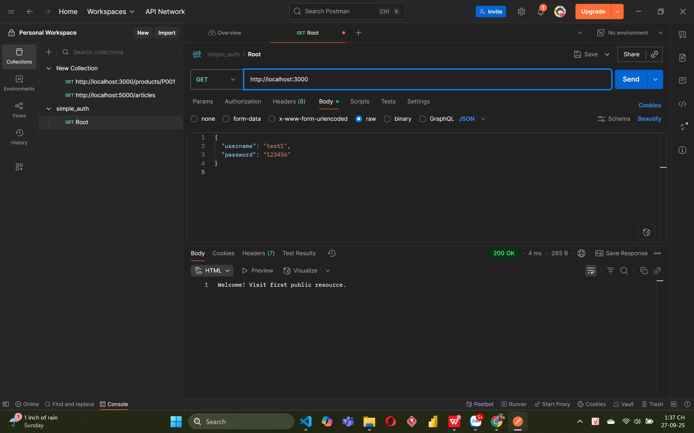

### 2. GET Public
- **Method:** GET
- **URL:** http://localhost:3000/public
- **Steps:**
  - Open Postman, set method to GET.
  - Enter URL: http://localhost:3000/public
  - Send request.
- **Result:** Check response status (e.g., 200 OK).
- **Screenshot:** 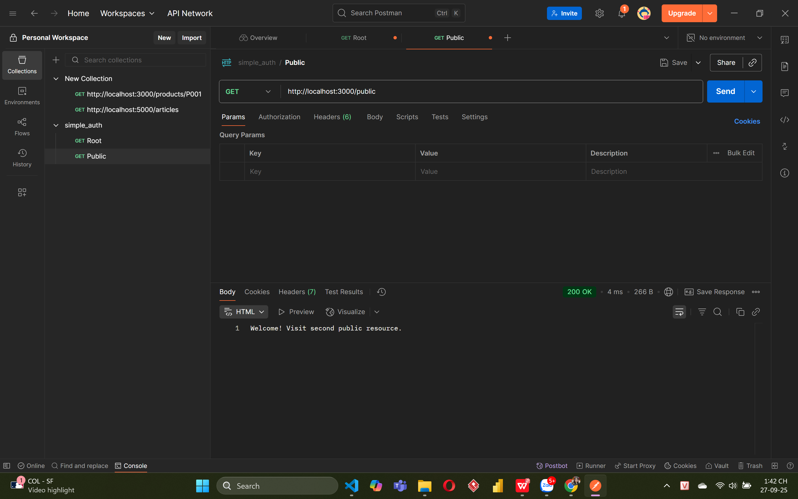

### 3. GET Secure - No Auth
- **Method:** GET
- **URL:** http://localhost:3000/secure
- **Steps:**
  - Open Postman, set method to GET.
  - Enter URL: http://localhost:3000/secure
  - Do not add Authorization header.
  - Send request.
- **Result:** Check response status (e.g., 401 Unauthorized).
- **Screenshot:** 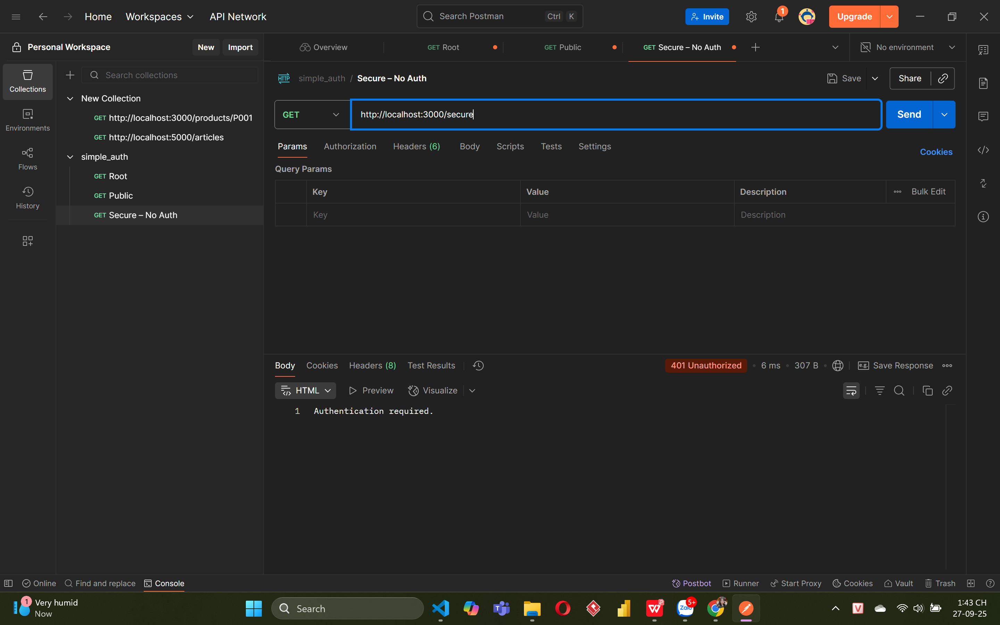

### 4. GET Secure - Wrong Auth
- **Method:** GET
- **URL:** http://localhost:3000/secure
- **Steps:**
  - Open Postman, set method to GET.
  - Enter URL: http://localhost:3000/secure
  - Add Authorization header with incorrect Basic Auth (e.g., Basic [wrong_base64]).
  - Send request.
- **Result:** Check response status (e.g., 401 Unauthorized).
- **Screenshot:** 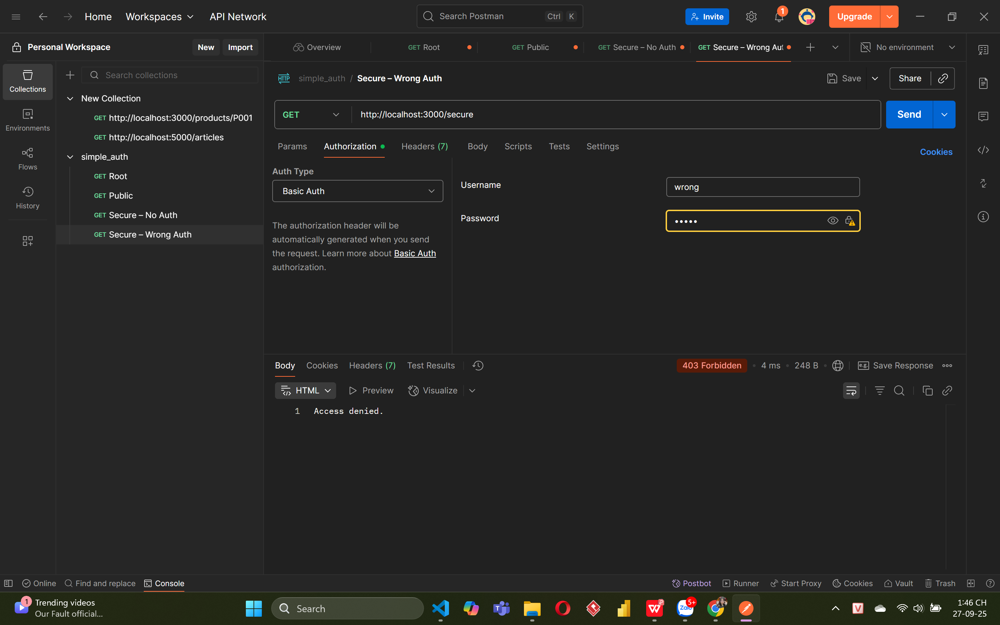

### 5. GET Secure - Success
- **Method:** GET
- **URL:** http://localhost:3000/secure
- **Steps:**
  - Open Postman, set method to GET.
  - Enter URL: http://localhost:3000/secure
  - Add Authorization header with correct Basic Auth (e.g., Basic [base64(username:password)]).
  - Send request.
- **Result:** Check response status (e.g., 200 OK).
- **Screenshot:** 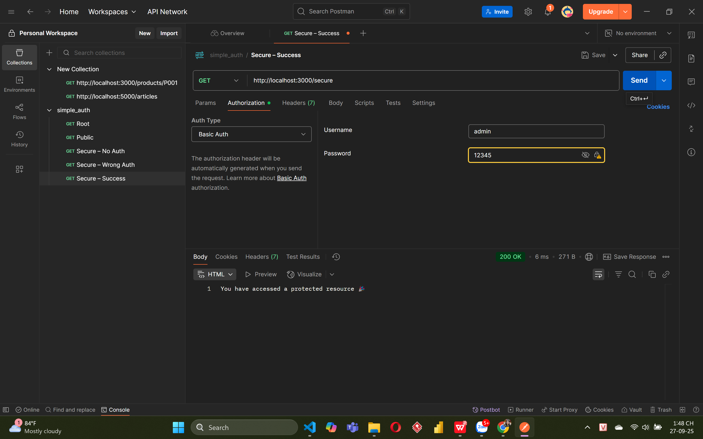

## How to Test with Postman (cookie_auth.js)

### 1. Run the Server
- Start the server by running: `node cookie_auth.js`
- Ensure MongoDB is running locally (e.g., mongodb://localhost:27017).

### 2. POST Login
- **Method:** POST
- **URL:** http://localhost:3000/login
- **Steps:**
  - Open Postman, set method to POST.
  - Enter URL: http://localhost:3000/login
  - Add body: { "username": "admin", "password": "12345" } (adjust based on source code).
  - Send request.
- **Result:** Check response status (e.g., 200 OK) and cookie in Cookies tab.
- **Screenshot:** 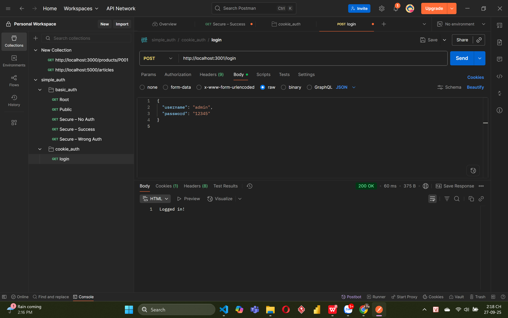
- **MongoDB Check:** View session in MongoDB Compass (e.g., sessions collection).
- **Screenshot:** 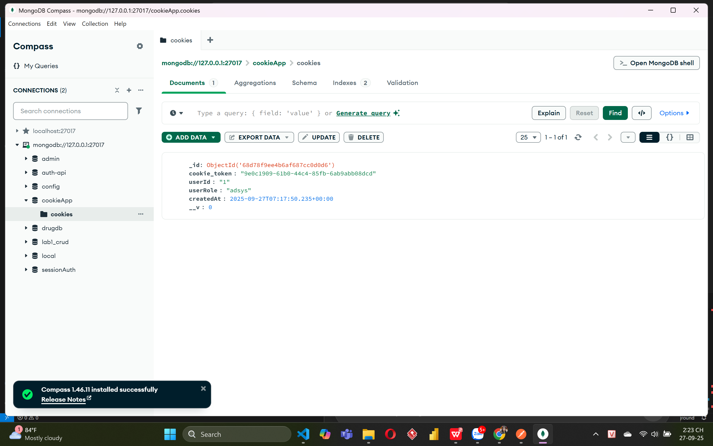

### 3. GET Profile (No Cookie)
- **Method:** GET
- **URL:** http://localhost:3000/profile
- **Steps:**
  - Open Postman, set method to GET.
  - Enter URL: http://localhost:3000/profile
  - Do not add cookie.
  - Send request.
- **Result:** Check response status (e.g., 401 Unauthorized).
- **Screenshot:** 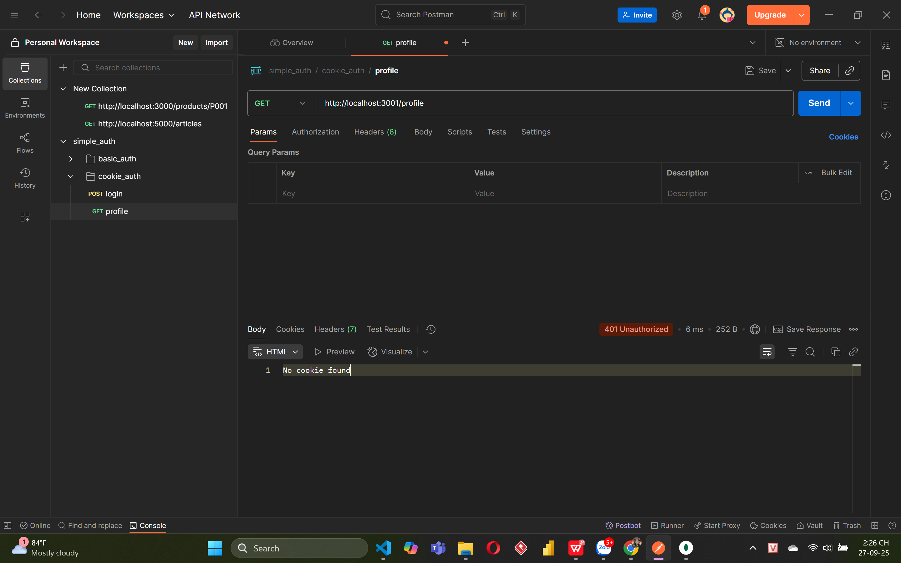

### 4. GET Profile (Success)
- **Method:** GET
- **URL:** http://localhost:3000/profile
- **Steps:**
  - Open Postman, set method to GET.
  - Enter URL: http://localhost:3000/profile
  - Add cookie from login request in Cookies tab.
  - Send request.
- **Result:** Check response status (e.g., 200 OK) and user data.
- **Screenshot:** 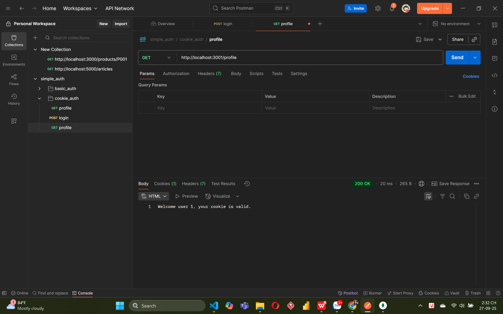

### 5. GET Logout
- **Method:** GET
- **URL:** http://localhost:3000/logout
- **Steps:**
  - Open Postman, set method to GET.
  - Enter URL: http://localhost:3000/logout
  - Add cookie from login request in Cookies tab.
  - Send request.
- **Result:** Check response status (e.g., 200 OK) and verify cookie is deleted.
- **Screenshot:** 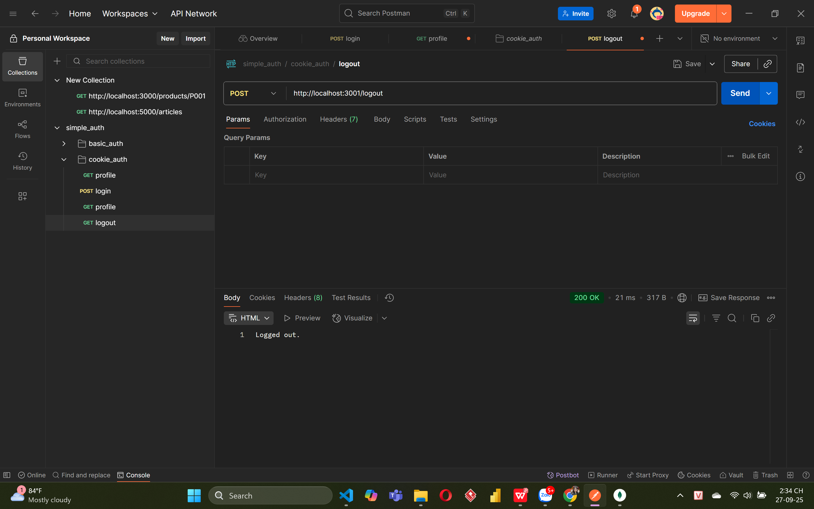
- **MongoDB Check:** Verify session is deleted in MongoDB Compass.
- **Screenshot:** 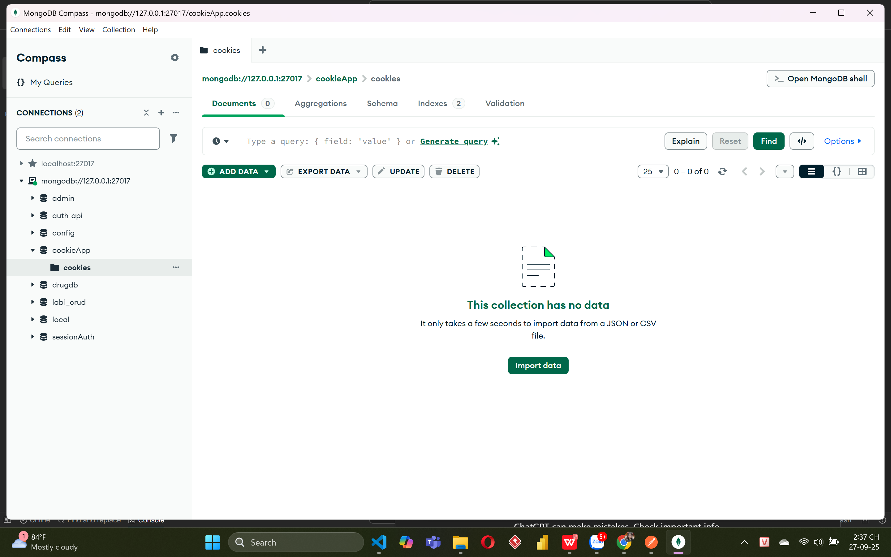